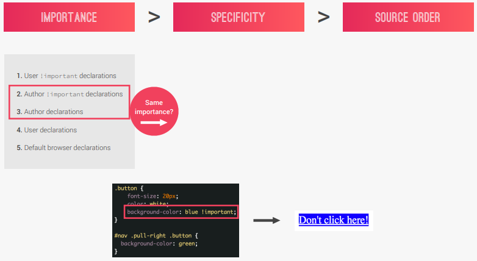
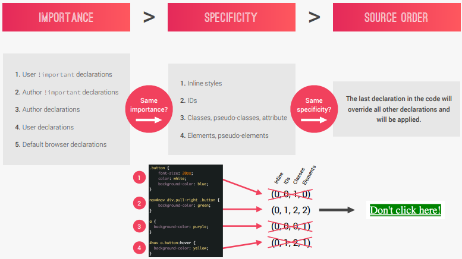
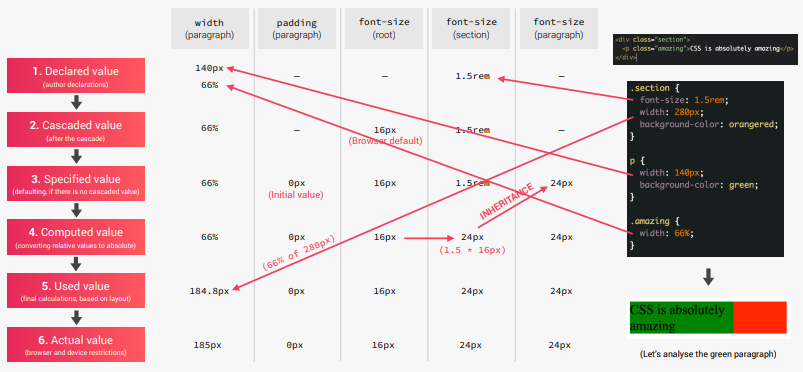
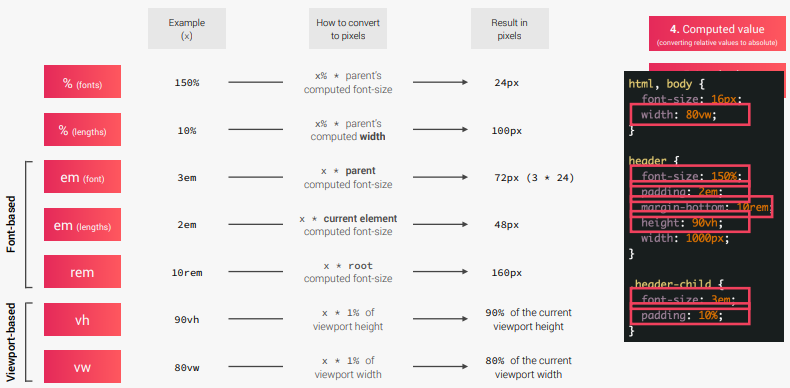
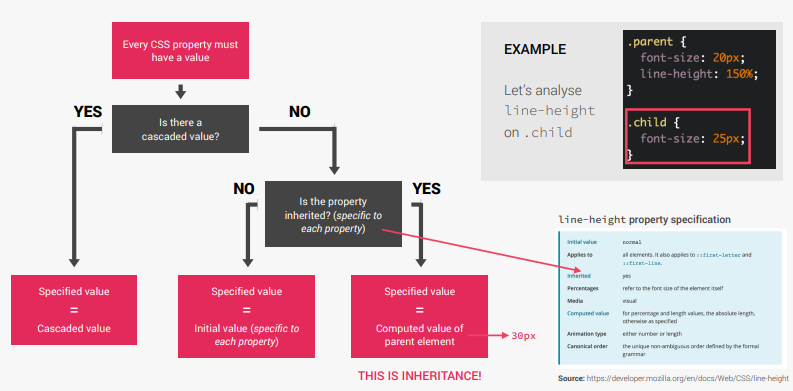
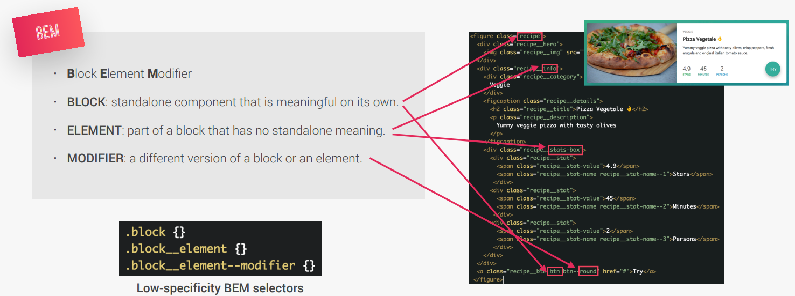

# HOW CSS WORKS

## THREE PILLARS OF WRITING GOOD HTML AND CSS

- Responsive Design
  - Website should work on devices with different screen sizes
  - Using concepts like fluid layouts (grids and flexbox), media queries,
    responsible images, correct units and a mobile-first approach
- Writing Maintainable and Scalable code
  - To write reusable code
  - Importance should be granted on file structure organisation, class naming
    conventions, and how to structure HTML
- Web Performance
  - Make the site as small as possible so that the user has to download less
    data
  - Code should make less HTTP Requests (so less files should be included, in
    particular images and their sizes), compress code and use a CSS Preprocessor

## WHAT HAPPENS WHEN YOU LOAD UP A WEBPAGE ON THE BROWSER?

- When a browser starts to load the initial HTML page (index.html) - Parses it (Decodes it line-by-line) to form the Document Object Model (DOM) - The DOM describes the entire web document like a family tree - During parsing the browser finds the stylesheets included linked to the HTML
  and starts to load and parse them as well into CSS Object Model (CSSOM) - Parsing of CSS is done in 2 stages: - Conflicting CSS declarations are resolved through Cascade - Final CSS values are processed (converting units to px) - The DOM and CSSOM form the Render Tree, using which the website is rendered
  on screen via the Visual Formatting Model - The website is finally painted on the screen
  [Webpage Loadup](./images/webpage-rendering.png)

## CASCADE

- It is the process of combining different stylesheets and resolving conflicts
  between different CSS rules and declarations when more than one rule applies to a certain element
- Conflicts can occur due to declarations coming from different sources:
  - Author stylesheets - The ones which developers write
  - User stylesheets - The changes made to CSS by the user in Chrome Tools
  - Browser stylesheets (user agent) - Browser's own styling
- To resolve conflicting styles when more than one rule applies on a
  particular element, CSS looks at Importance > Selector Specificity > Source
  order of conflicting declarations to determine which rule will take precendence - Cascade gives different importance's to different declarations based on the
  source
   - If importance is same, cascade calculates and compares the specificities of
  the declaration selectors. The value with the winning declaration is called
  the cascaded value
   - If specificity is also same, the last CSS declaration in the code will apply
- The universal selector has no specificity value (0, 0, 0) - So all other
  selectors have precendence over it
- Always rely on specificity and not on the order of selectors - This will
  prevent styles from getting changes if the order in which they are declared is
  altered - Only exception to this rule is when using third-party stylesheets - always
  put your stylesheets last (so that your rules override the ones defined in the
  included ones, for eg. reset stylesheet)

## VALUE PROCESSING

- All measurement units (percent, em, rems, vh, vw) are transformed into px
- Types of values: - Declared values - Values used in author declarations - Cascaded values - Values determined after cascade (victor value) - Specified values - Default values, used if there are no cascaded values - Computed values - Converting relative values to absolute (px) for
  inheritance purposes (also keywords like `auto`) - Used value - CSS uses the rendered layout to figure out some values (such
  as percentages as they are dependent on the device, which can only be done
  after rendering) - Actual value - Used values are rounded by browser and device restrictions
  
- Each and every CSS property needs to have a value, even if we don't declare it
  Either this value will come from the browser's user agent stylesheet, or from
  CSS specification using CSS
- For `padding`
  - Specified value is 0px
  - Browser doesn't provide any padding of its own through user agent stylesheet
- For root `font-size` browser chooses a font-size of 1rem = 16px (this value
  comes from a user agent stylesheet, and is not a CSS specification specified
  value)
- Some properties (like ones related to text such as font-size) inherit the
  computed value of their parent element

### HOW DOES CSS CONVERT RELATIVE UNITS TO PIXELS?

## INHERITANCE

- Process of propagating property values from parent elements to their children
  
- Generally properties related to text are inherited - font-family, color,
  font-size
- The `inherit` keyword forces inheritance on a certain property

## THE VISUAL FORMATTING MODEL

- An algorithm that calculates boxes and determines the layout of these boxes
  for each element in the render tree, in order to determine the final layout of
  the page
- It takes into account the dimensions of the boxes (using box model), box-type
  (inline, block, or inline-block), positioning scheme (absolute, relative, fixed)
  stacking contexts, other elements of the render tree (parents and siblings), and
  external information such as viewport size, dimensions of images, etc

### STACKING CONTEXT

- Used to determine in which order elements are rendered on the page
- They are like layers that form a stack. They can be created by multiple
  properties (such as `z-index`, `opacity` when not set to 1, `transform`, etc.)
- Layers on the bottom of the stack are painted first, and layers on top are
  rendered later, thus overlapping the element below them

## CSS ARCHITECTURE

- Component Driven Design

  - Break our page into reusable components
  - They are joined by layout of the page to form the interface
  - They should be completely reusable, even across projects
  - They should be independent of their parent so that they can be used
    anywhere on the page

- How should you name your classes in HTML and CSS? - Use the BEM (Block Element Modifier) naming convention - Block - standalone component that is meaningful on its own - Element - part of a Block that has no meaning of its own. Its name will have
  the block's name embedded inside (to denote its relevance) - We can get away with using only classes which are never nested, thus using
  very low specificity selectors - Modifier - a flag we can put on a Block or Element in order to make it
  different from regular Blocks or Elements (a different version)
  

- How to structure your CSS?
  - 7 different folders for partial Sass files
    - base - basic product definition
    - components - one file for each component
    - layouts - where we define the overall layout of the project
    - pages - styles of specific pages of the project
    - themes - for different visual themes
    - abstracts - code which doesn't output any CSS (variables or mixins)
    - vendors - all third party CSS goes
  - 1 main Sass file to import all other files into a compiled CSS stylesheet
