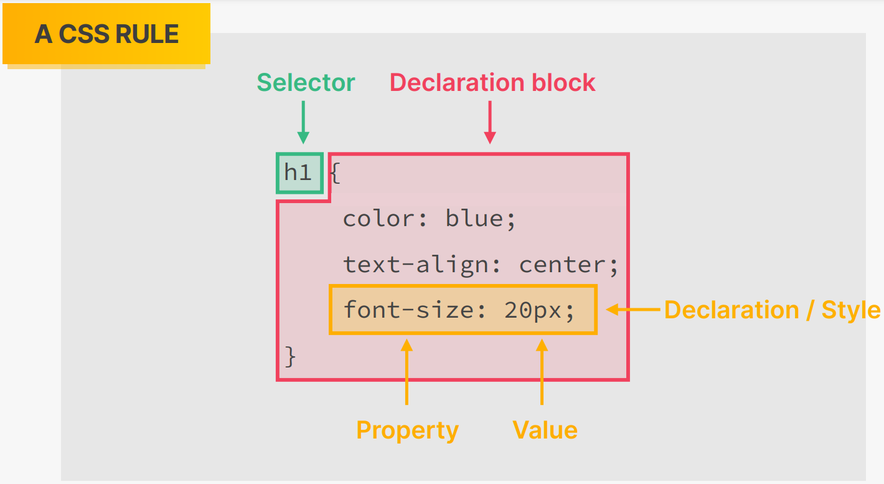
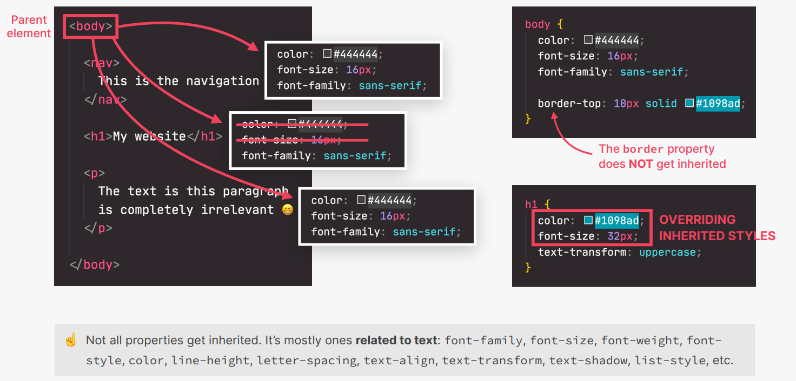
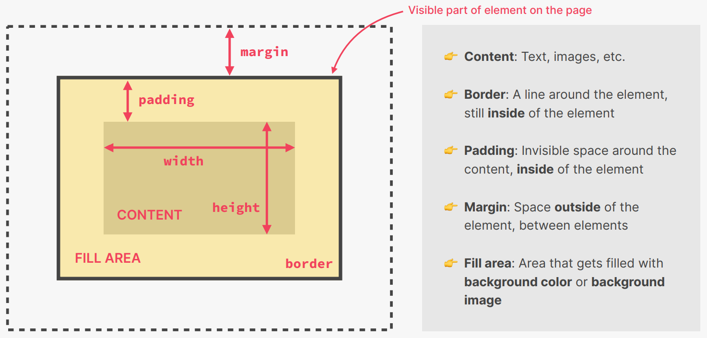
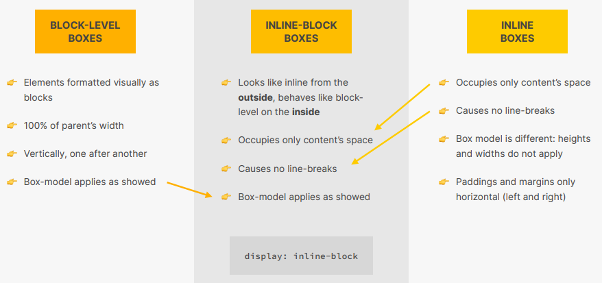

## INTRODUCTION

- CSS - Cascading Style Sheets
- 
- How can you include CSS into your HTML?
  1. Inline - Inside the HTML element using the `style` attribute (Don't use)
  2. Internal - Inside the `style` element in the `head` element of HTML file.
     This provides better separation of concerns, but can be a problem if there
     is a lot of CSS (Prefer not to use)
  3. External - Writing CSS rules inside another css file, and link the file to
     the HTML document to be styled

```html
<head>
  <title>Demo CSS Inclusions</title>
  <!-- Internal CSS -->
  <style>
    h1 {
      color: white;
    }
  </style>
  <!-- External CSS -->
  <link rel="stylesheet" href="./style.css" />
</head>
<body>
  <!-- Inline CSS -->
  <h1 style="background-color: white">Hello CSS</h1>
</body>
```
```css
h1 {
  width: 1000px;
}
```

## SELECTORS

- Universal Selector `* { ... }`
  - Targets every element on the page
  - Used as a reset to set `margin`, `padding`
  - Will cause a performance hit if used in any other reference
- ID Selector `#id { ... }`
  - Targets elements based on `id`
  - Since `id` can be used only once on a HTML document so it is highly specific
  - Don't allow for reuse and should not be used
- Class Selector `.class { ... }`
  - Can be used to target multiple elements as `class` attributes can be used
    multiple times across a webpage (unlike `id`)
  - Use when you want your styling to apply to a group of elements
- Element Selector `element { ... }`
  - Used to target all elements of a particular type on a page
- Combinator Selectors
  - Descendant Combinator `element1 element2 { ... }`
    - To target all element2 which are within element1
    - Prevent too much nesting
  - Adjacent Combinator - `element1 + element2 { ... }`
    - Select only element2 that is immediately preceded by element1
  - Child Combinator `element1 > element2 { ... }`
    - To target only direct children of type element2 inside element1
  - Sibling Combinator `element1 ~ element2 { ... }`
    - Select all element2 that follow element1
- Attribute Selectors
  - `element[attribute]`
    - Select all elements that have the attribute set for them
  - `element[attribute="value"]`
    - Select all elements that have an attribute with value set to the specified
      value
  - `element[attribute*="value"]`, `element[attribute^="value"]`,
    `element[attribute$="value"]`
    - To select all element that have an attribute with value containing,
      starting, and ending with value
  - `element[data-*="value"]`
    - Use custom attributes
    - Used to select elements when there are multiple values for the attributes
- Pseudo Selectors
  - `element:visited, element:link`
    - To select all elements that have yet to be, already visited
  - `element:checked`
    - To select all elements that have been checked
    - Used for checkboxes and radiobuttons
  - `element::after`, `element::before`
    - Used to specify content around the selected element
    - `content` property is required
  - `element:hover`
    - User Action Pseudo class
    - Used to style the selected element when the user hovers over it
  - `element::first-line`, `element::first-letter`
    - Used to select first line, first letter of the selected element
    - Only applicable on block-level elements
- Nth Child and Type Selectors
  - `element:nth-child(n)`
    - Accepts an integer ranging from 1 to n (number of siblings of same type)
    - To accept every xth element use (xn) as parameter value
  - `element:nth-last-child(n)`
    - Select the nth sibling from last
  - `element:nth-of-type(n)`
  - `element:nth-last-of-type(n)`
  - `element:first-child`
  - `element:last-child`
  - `element:only-child`

## GENERAL STYLINGS RULES

- Styling has to be done for `li` elements, and not `ol` or `ul`

  - To remove bullets use `list-style: none;` declaration

- `transform`
  - Used to rotate, scale, skew, translate an element
  - Order of functions is important (rotate moves the axis of movement as well,
    so if you translate after rotation, the x and y axes have rotated, and
    translation will be done along the new x and y axes)

```css
transform: rotate(<n>deg); /* rotate n degrees clockwise */
transform: translate(<x>px, <y>px); /* Shift along x-axis by x units; along y
axis by y units; x and y can be negative as well */
transform: scale(<x>, <y>); /* Scale horizontally by x, vertically by y */
transform: translate(<x>px, <y>px) rotate(<n>deg); /* Translate then rotate */
```

## TYPOGRAPHY

- `font-family: system-ui, sans-serif` - Ideal for website (to remove the small
  edges on letters and use system font instead of loading a custom font) - To be
  used on the `body` element and not the `html` element for semantics
- `font-size: 26px` - Set size of font
- `font-weight: bold/100/200/.../900` - For boldness of font
- `font-style: italic` - To italisize the letters
- `text-transform: uppercase/capitalise` - To change the case
- `text-align: left/right/center` - Text alignment
- `line-height: 1.5` - Recommended for normal font sizes (spacing between lines
  will be 1.5 times that of the font-size)

## COLORS

- [RGB Model in CSS](./images/rgb_model.png)
- [Color Representation in CSS](./images/rgb_notation.png)
- Grey is formed when all colors have equal values (#000 - black; #fff - white)
- `color` - Defines text color
- `background-color` - Defines color of page

## PSEUDO CLASSES

- `:first-child`, `:last-child`, `:nth-child(odd/even)` - Dealing with HTML
  structure
- They don't work great when we mix multiple elements inside a parent element,
  but work great when all the child elements are the same (like in a `ul` or `ol`)
- Styling links:
  - `a:link` - Styling links which have an `href` attribute
  - `a:visited` - Color after a link has been visited (keep it the same as the
    normal link)
  - `a:hover` - Styling when mouse hovers over the link
  - `a:active` - Styling when mouse clicks over the link (When a link is
    active it is simulatenously being hovered upon as well)
  - Use `text-decoration: none` to remove any underlines that default links
    have; It also takes 3 values - `line_used style_of_line color_of_line`
- Styling buttons:
  - They have the `hover` state from links and just the normal state
  - Often used properties - `border: none; cursor: pointer`

## DEV TOOLS

- Element Tab for HTML
- Element -> Styles subtab for CSS
- Selecting an element shows all the styles applied on that element (as well as
  the last style contains the default styling applied by the browser)
- Use the Styles -> Filter section to apply hover and active effects on links
  without having to actually hover on them to view the styles

## INHERITENCE

- Mechanism by which some styles get assigned to an element from their parent
  elements
- But inherited rules get overwritten very easily in case of conflicts
- Mostly styles related to typography get inherited (and not all styles). So
  include them in the `body` tag as we would want uniformity in our text
- Universal Selector (`*`) selects all the elements and applies a styling to all
  of them. But it has the lowest priority and can easily get overwritten. But this
  follows a different mechanism than inheritance as this applies the rules to all
  elements specifically. Use this for properties that don't get inherited, and use
  the `body` element to apply styles to all elements that do get inherited (mostly
  font related settings)
- 

## BOX MODEL

- It describes how elements are displayed on a webpage and how they are sized.
  Everything is a box on the web
- Box Model applies to everything on the web. It consists of:
  - Content - Width and height of an element
  - Padding - Adds space inside of an element between the content and border.
    Used most often on elements with some `background-color`
  - Border - A lien around the content but inside the element
  - Margin - creates extra space around an element which pushes away the other
    elements away. Used to create space between boxes
  - Fill Area - If we apply a `background-color` or `background-image` to an
    element, it will occupy the entire visible part (content + padding + border)
  - These are all optional
- 
- To view an element's box model in Dev Tools - Select the element using the
  `Element Selector` tool and go to the `Computed` tab

```html
<div class="box">Hello World</div>
```

```css
.box {
  font-size: 2rem;
  background-color: pink;

  /* BOX MODEL */
  display: block;
  height: 100px;
  width: 300px;

  /* padding-top -> padding-right -> padding-bottom -> padding-left */
  padding: 32px;
  padding: 32px 100px;
  padding: 32px 100px 64px;
  padding: 32px 100px 32px 64px;

  /* size style color */
  border: 5px solid black;
  /* border-top; border-bottom; border-right; border-left */

  /* margin-top -> margin-right -> margin-bottom -> margin-left */
  margin: 20px;
  margin: 20px 40px;
  margin: 20px 40px 20px;
  margin: 30px 30px 30px 30px;
}
```

- When two margins occupy the same space (for e.g. the `margin-bottom` of one
  element with the `margin-top` of another element), they don't get added up.
  Rather only the larger one shows on the webpage. This is called collapsing
  margins.
- If you select an element in Dev Tools and go to the `Styles` panel, you will
  get the `user agent stylesheet` showing the default styles applied by the
  browser
- Under normal circumstances, `border` and `padding` are inside the block
  element, and when calculating the net effective `height` and `width` of the
  element, we need to add them up. This is tedious so use `box-sizing: border-box`
  (normally it is `box-sizing: content-box`). Using this, the `height` and `width`
  would define the dimensions of the fill area, and not that of the content area

```css
*,
*::before,
*::after {
  box-sizing: border-box;
}
```

- Inline boxes occupy the space they need for their content, and cause no line
  breaks after or before the element. `height` and `width` do not apply on these
  elements and `padding` and `margin` only applies horizontally. For e.g. `a`,
  `img`, `strong`, `em`, `button`, etc. Use `display: inline` for creating inline
  elements
- Block level boxes occupy the entire width of their parent. So they cannot be
  side-by-side with one another. Use `display: block` to create block elements
- If you set `height` on an element then it becomes fixed and won't expand even
  if the content takes up more space (thus causing overflow). Thus `height` should
  not be fixed for elements unless absolutely necessary
- Inline-block elements combines the best of both worlds - they occupy the width
  of the content and cause no line breaks (thus acting as `inline`) but we can add
  `padding`, `margin`, `height` and `width`
- 

## CSS RESET

- Added to the universal selector they don't get inherited, and so we can't use
  it on the `body` element and hope all other elements inherit it from that rule

```css
* {
  margin: 0;
  padding: 0;
}
```

## SIZING IMAGES

- Use dimensions on our images in CSS only (not in HTML using attributes `width`
  and `height`)
- If you use just one attribute, use `auto` for the other dimension to maintain
  the aspect ratio

```css
img {
  width: 100px;
  height: auto;
}
```

## CENTER CONTENT ON A WEBPAGE

- Put the entire content inside a container (non-semantic `div` will work), give
  it a `width` and grant it a `margin: 0 auto`
- While adding `margins` after a universal reset, choose `margin-bottom` and
  stick to that (keep applying only `margin-bottom` to the elements below which
  space is required, so as to not face the issue with collapsing margins)

## POSITIONING

- If you simply place element in HTML, they will move other elements around it

- Use CSS Positioning to insert elements into pages without altering the
  position of other elements

- `top, right, bottom, left` properties are unlocked when the `position`
  attribute is assigned a value

- `position: absolute`
  - The element gets removed from the document. No space is created for them,
    and other elements are placed as if the element with absolute positioning
    never existed
  - The `top, right, bottom, left` attributes are calculated from the page. If
    you want them to be calculated based on the element's container, the
    container should have `position` attribute (any value will work except
    `static` which is the default `position` value)
  - If you want the popped-out element to stack underneath the normal page,
    use `z-index: -1`
  - If you are placing element using the `top, right, bottom, left` attributes
    and a horizontal scroll-bar is appearing, just add `overflow-x: hidden` to
    the `body` element
- `position: relative`
  - The element remains in the normal flow of the document, but has access to
    `top, right, bottom, left` properties as well as `z-index`
- `position: fixed`
  - The element is removed from the normal flow of the document just like
    `absolute`
  - The difference with `absolute`

## DEBUGGING AND DOCUMENTING

- Use HTML validators and Git Diffs for HTML
- Use Developer Tools (specifically Styles and Computed Tabs) to debug CSS
- Use MDN Documentation for reference

## PSEUDO ELEMENTS

- Don't exist in the HTML but we can still select them and style them in CSS
- They are inline elements, and so to apply `margin` and `padding` change the
  `display: inline-block`

```css
h1::first-letter {  /* First letter of a paragraph */
    font-style: normal;
    margin-right: 5px;
}

p::first-line { /* First line of every paragraph element */
    color: red;
}

h1::after {
    content: "TOP"; /* Can be empty as well, but content is required property */
    background-color: #00ffff;
}

h2::before {...}
```

## BUTTON STYLING

- Should always include `border: none; cursor: pointer`
- They are like inline-elements - `text-align` affects them
- `color` doesn't get inherited by them - so will have to add it explicitly
-

## RESPONSIVE WEB DESIGN

- Webpage should adjust its layout and visual style to any possible screen size

### FLUID LAYOUTS

- Allows webpage to adapt to the current viewport Width
- Use % (or vh/vw) units instead of px for adaptable layout related elements
- Use `max-width` instead of `width`

### RESPONSIVE UNITS

- Use `rem` instead of px for most lengths
- This is done to scale the entire layout up or down automatically
- Set 1rem=10px for easy calculations

### FLEXIBLE IMAGES

- Images do not scale automatically as we change viewport by default
- Always use % for image dimensions together with max-width

### MEDIA QUERIES

- To change CSS styles on certain viewport widths (breakpoints)
- Creating new types of website for different viewports (different devices)
- Should be implemented only at the end of the building a certain component

## STRATEGIES FOR BUILDING RESPONSIVE WEB DESIGN

### DESKTOP-FIRST

- Start writing CSS for large screens
- Add media queries to shrink design to smaller screens

### MOBILE-FIRST

- Inverse of Desktop-first
- We can reduce websites to just absolute essentials
