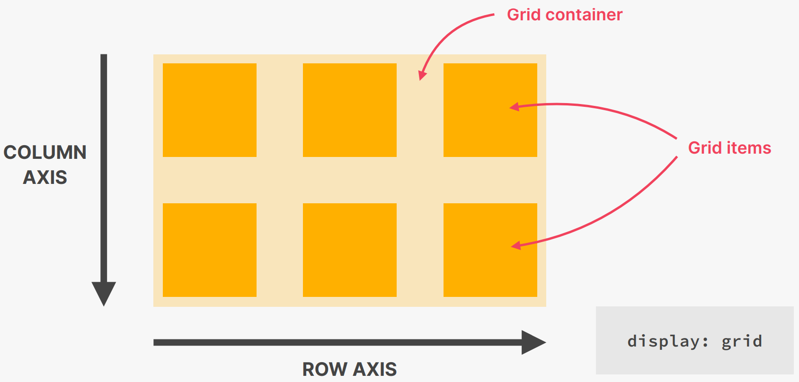
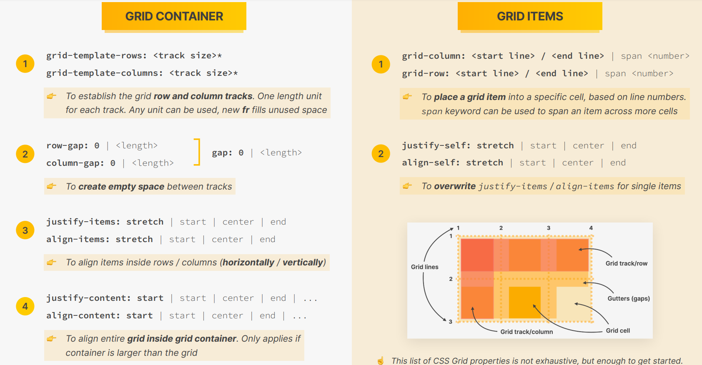
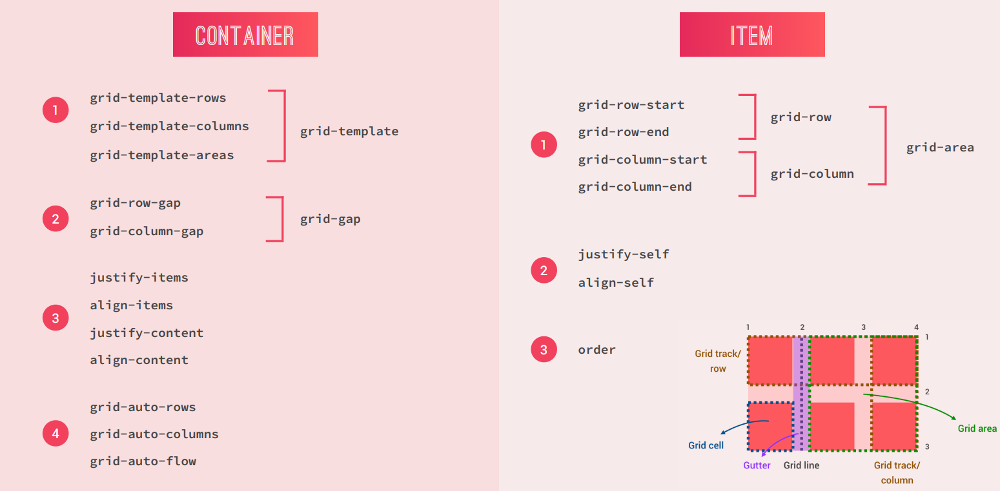

## TYPES OF LAYOUTS

- Page Layout - Layout down elements (big pieces of content) inside of a webpage. They are themselves made out of components, who have their own layouts.
- Component Layout - The layout of each component which makes up the webpage. We cannot lay down elements one after the other in a component as it would lead to bad UX

## LAYOUT FORMATS

- Flexbox - When you want elements' intrinsic widths to have a say in the final
layout (for eg. in a navigation menu, we would like each button to be a certain
width depending on the length of the menu item, and not all items should be as
long as the longest menu)
- CSS Grids - When you want a rigid pattern (equal width columns or rows) with
each element having basically no say in what should be their widths. They need 
to fit into the cells provided to them
- Floats (only legacy purposes)
- Hidden - `display: none`
- To center the whole section of content use a container utility class, provide
it a width and set `margin: 0 auto`

## FLEXBOX

- Flexbox always starts by calculating the content size for each flex item. This
is intrinsically set to `width: max-content` for each flex item (provided the
items don't have a width explicity set for them using `width` or `flex-basis`). 
If so then the specified width will be the width of the flex item (`flex-basis`
overrides `width` values for flex items)
- Vertically though each item will be as tall as the tallest flex item.  
```css
/* .container class becomes the flex container */
/* all immediate children of .container become flex items */
.container {
    display: flex;
    /* To align items along the cross axis */
    align-items: flex-start/flex-end/center/stretch (default);

    /* To align items along the main axis */
    justify-content: flex-start/flex-end/center/space-between/space-around;
}
```

- Flexbox solves common problems such as vertical centering and creating equal
height columns. Empty space inside a container element can be automatically
divided by its child elements
- 
- 

- `gap` property was introduced to insert gaps between flex-items, without
having to remove gap from the items at the extreme ends

- We don't specify the `width` of each flex item using the `width` property. Use
the `flex-basis: <value>` property. It is sort of a recommendation to grant the
elements the specified width, but there can be a situation where if the items
are at that specified width, they will overflow the flex container

- By default, flex items will occupy width = max(`width`, `max-content`)
    - If SUM(width of each flex item) <= width(flex container) then its fine
    - If SUM(width of each flex item) > width(flex container) then `flex-shrink`
    comes to the rescue
        - if `flex-shrink: 0` then items would overflow the flex container
        - if `flex-shrink: 1` (default) then flex items would shrink equally
        until their `width` = `min-content`, after which they will overflow the
        flex container on further shrinking

- By default `flex-grow: 0`. So flex items occupy width = max(`width`, 
`max-content`)
    - If SUM (width of each flex item) >= width(flex container) then items get
    squished as per `flex-shrink` property
    - If SUM(width of each flex item) < width(flex container) then `flex-grow`
    comes into picture
        - If `flex-grow: 0` (default) then nothing happens
        - If `flex-grow: 1` then the remaining space will be evenly distributed
        amongst all the flex items. Thus the flex items will have a width of
        max(`width`, `max-content`) + (remaining-size/number of flex-items). 
        This means that there is no guarantee that flex items become of equal
        width (in fact they will become equal width only if they had equal width
        initially before `flex-grow: 1`)
            - If this is applied to an individual flex item, then 


- Then it arranges the items in a row, or in a column depending upon the value
of `flex-direction` property
- Now it will start looking if the elements overflow the flex container along
the main axis, and depending upon the value of `flex-shrink` it will either
shrink the items, or let them overflow the container (by default it shrinks)
- If the items don't overflow the container, and rather there is empty space
present after placing the elements, then the `flex-grow` property comes into
picture. If its is set to 1, then the remaining space will be divided and added
to the flex items
- Both the shrinking and the growing takes place proportionally to the width of
the flex items. So if the width of an item is large initially, the change in its
width due to a shrink or growth will be larger, as compared to that of a smaller
width flex item


- However, if there is no width specified to the flex items, the `flex-grow`
property comes into the picture. It is 1 by default, which allows the flex items
to be of equal width and thus grow to the max possible width without overflowing
the flex container. If it is 0 then they will occupy just the width of their
content. If you apply this only on a single element, then the rest of the
elements will first be placed, each given just enough width to accomodate their
content, and the remaining space will be granted to the `flex-grow: 1` item. But
putting `flex-grow: 2/3/4...` (any number greater than 1) 

- To set columns of equal size we can use two approaches on all the flex items:
    - We can set the `flex-basis` of each flex item to be 100% of the width of
    the flex container, and set `flex-shrink: 1`. So now every element would
    want to be as wide as the flex container, but when flexbox will see that the
    flex items are overflowing the container, then it will start shrinking the
    flex items. But since all flex items were given same initial widths, so they
    will shrink same amount (keeping change proportional) and thus end up with
    the same widths
    - Another approach will be to set `flex: 1` for all the flex items. This
    sets the content size of each flex item to 0, and since we have `flex-grow`
    as 1, so these elements would grow to take up all the available space (which
    is the entire container's width in this case)
- Both of these approaches will not provide equal width columns if the flex
items themselves don't have equal amounts of padding or border. This is because
flexbox works on content width, and ignores padding and border widths. So
    - In the first approach, the total space that will need to be distributed
    amongst the flex items would be (width of all flex items - total padding -
    total border). After division of this space amongst the flex items, the
    padding and borders would be added to the elements
    - In the second approach, the total space that will need to be distributed
    amongst the flex items would be (width of the flex container - total padding
    - total border). After division of this space amongst the flex items, the
    padding and borders would be added to the elements.
    - For an equal amount of total width, padding and border, the second
    approach gets us closer to the exact ideal amount for each flex item (which
    would basically ignore the subtraction of padding and border, and use a
    similar approach to `border-box` property, as the deducation is being done
    on a much larger space rather than just the flex container's width)
```css
/* First Approach */
.flex-container > * {
    flex-basis: 100%;
    flex-grow: 0;
    flex-shrink: 1;
}

/* Second container */
.flex-container > * {
    flex: 1;
    /*
    flex-grow: 1;
    flex-shrink: 1;
    flex-basis 0;
    */
}
```
- To irradicate this issue use grids since we require a rigid structure where
each column needs to be of equal widths, and the content of an child element
should have no say in the width that it should occupy in the final layout

- Other features (such as `align-items`, `justify-content`) work on the same
principle of calculating available space by subtracting margins and paddings
from the total available space (so similar to the operation of `content-box`).
So if elements are not aligning properly even after adding these properties then
the issue is with flex items not having same amounts of `margin` or `padding`

- Flexbox treats text as flex-items. So we can use `align-items` and
`justify-content` to center text in a `div`

## CSS GRID

- CSS Grids have a Grid Container and Grid items. It will take up the entire
viewport width for the grid container regardless of the number of columns unless
there is a height or width defined for the container
- Just like flexbox, the padding, margin and border widths are subtracted from
the total space before distributing the left over space amongst the columns. So
the content boxes will have same width if they are all given same fr units, but
if padding used on each grid item is different, the column widths will look
different as well
```css
.grid-container {
    display: grid;
    /* If viewport width is 500px then the border will form a rectange of 500px
    width and height as per the total row height depending on content */
    grid-template-columns: 100px 100px;
    outline: 1px solid blue;
}
```


- `grid-template-columns: <width_value1> <width_value2> ... <width_valuen>` - 
Define as many width values as you want, and n number of columns will be created
as per the specified widths. As many rows will be created as per requirement to 
accomodate the items. The value of these dimensions can be in pixel, or percent
    - If the values for width of each column > max-content for each cell, then
    the grid item content will fit easily in the allocated cell
    - If the value for width of a column < max-content for a particular cell the
    content will go into the next line in the same cell (thus increasing height
    of the cell, and thus height of the whole row). This behavior will happen
    provided the width is at least the width of the longest word in the content
    - If the width of the particular cell < the longest word in the content then
    overflow will occur as word can't be broken into different lines
    - If we define a `height` or `width` for a cell, the whole row or column 
    will adjust to match that dimension (if the dimension is too small then we 
    can end up with content overflowing the cell as well)
    - Putting `grid-template-columns: 1fr 1fr 1fr` will create 3 columns with
    equal width, and they will change at the same rate. If we put
    `grid-template-columns: 1fr 1fr auto` then the 3rd column will take only the
    space necessary for its content, and the remaining space will be divided
    equally between the 1st and 2nd columns
    - fr works by distributing the remaining space in the grid container as
        a fraction. First all the elements with the determined widths will be
        placed, and so will be the gaps. This can result in three scenarios:
        - Sum of all specified widths (either px or percent) and gaps > width of
        grid container, in which case we get overflow of content
        - Sum of all specified widths (either px or percent) and gaps = width of
        grid container, in which case there is no extra space left
        - Sum of all specified widths (either px or percent) and gaps < width of
        grid container, in which case the remaining space will be distributed
        proportionally to the columns listed with fr units (equal fr values will
        allocate equal proportions, different fr values will grant different
        amounts of space to that column)
    - For repeated values we can use `repeat()` function specifying the number
    and the size of columns/rows required
```html
<div class=".grid-container">
    <div class="item-1">Item 1 Item 1 Item 1 Item 1</div>
    <div class="item-2">Item 2</div>
    <div class="item-3">Item 3</div>
    <div class="item-4">Item 4</div>
    <div class="item-5">Item 5</div>
</div>
```
```css
.grid-container {
    display: grid;
    /* Will produce 3 columns of height equal to font-size since 1000px can
    accomodate the content in a single row if its width is 1000px */
    grid-template-columns: 1000px 100px 100px;
    
    /* Will produce taller row since the content will be broken into multiple
    lines in order to accomodate the content in a smaller width */
    grid-template-columns: 100px 100px 100px;

    /* Will produce overflowing content since the longest word (item) cannot be
    broken down into multiple lines */
    grid-template-columns: 10px 100px 100px;

    /* Equal width columns */
    grid-template-columns: 3fr 3fr 3fr;

    /* 1st column - Thrice the width of the other two */
    grid-template-columns: 3fr repeat(2, 1fr);

    /* 3rd column - width=max-content; Other two columns equally divide the
    remaining space in the grid container */
    grid-template-columns: 1fr 1fr auto;
}
```
- Similarly we can use `grid-template-rows` to define the height of each row
    - If height of a row is greater than height of each cell in that row
    required to fit that content, then the items will stretch to fill the entire
    cell
    - If height of a row is smaller than height of at least one cell then the
    content will overflow into the next cell
    - If we don't give the heights of each row, then the height will be the
    maximum height required to fit content of each cell (provided no height has
    been applied on an individual cell)
    - We can do use fr units for heights with explicit rows as well (explicit
    rows are the rows which are created and for which we explicitly define the
    height - any row created due to residual items is called implicity row). The
    height of a row (and thus the `fr` unit) will be determined by the tallest
    item in the row. If all the rows are given the same fr value, then all the
    rows will have the height of the tallest cell. If you use `auto` then the
    height of the row will be just enought to contain the content of the largest
    cell
    - Don't use this feature much as most of the times we won't need to use
    `grid-template-rows`. Let Grid figure the heights itself, and we will
    concentrate on columns mostly, and if need be then only add this property
- So we can understand is that dimensions provided to the individual grid items
take priority. If they are not present, then they will take the dimensions of
the grid. If content cannot fit into the dimensions (be it the grid dimensions
or applied on the grid item itself) then content will overflow


- To give space between items, `margin` won't work. Use `gap` (or `column-gap` and
`row-gap`)
```css
.grid-container {
    display: grid;
    grid-template-columns: 100px 100px 100px;
    column-gap: 30px;
    row-gap: 40px;
    /* Shorthand */
    gap: 30px;
}
```

- 
- 
- 
- 

- `auto` gives the width = max-content to a cell only when the widths of other
columns are defined as fr. If you use px or percent to denote the width of the
other columns, then `auto` will behave like fr instead


- To get grid items to span multiple cells we can use 
`grid-column: <start_column_no> / <end_column_no>` on the particular grid item 
and not the grid container (we can use either the positive column number or the
negative column number). If we don't want to do the math, just use the start
column number followed by the `span` word 
(`grid-column: <start_column_no> span <number_of_columns>`). Same can be done to
`grid-row` to span across rows
    - The start and end columns (or the span amount) must make sense and the
    grid should actually have that many rows and columns
    - They are shorthands for `grid-column-start`, `grid-column-end` and
    `grid-row-start` and `grid-row-end` properties. By default, the values for
    `grid-row-end` and `grid-column-end` are 1 + `grid-column-end/start`
    - The items will not swap places, rather they will shift to the right to the
    next grid cells, thus making way for the manually placed grid item
    - Use negative line numbers when you want to span till the end to the grid,
    or close to the end (without having to think about how many columns are
    present in the grid)
    - `grid-area: <row_start> / <column_start> / <row_end> / <column_end>` is
    the ultimate shorthand
    - Spanning an item across multiple cells will shift the remaining items only
    if they have not been explicitly placed at their present grid cell. If we
    try and place multiple grid items over a particular cell by explicitly
    specifying using `grid-column` and `grid-row` properties, then we will get
    overlap, and we can use `z-index` to determine which element stays on top
    and which one gets hidden
```css
.grid-item-n {
    grid-column: 1 / 2;
    grid-row-start: 3;
    grid-row-end: -1;

    /* Using span for shorthand */
    grid-row: 3 / span 4;
}
```


- Instead of using line number to denote start and end of a particular grid item
in the grid container, we should use line names (more professional and semantic)
    - Use this only after the template has been completed using line numbers
```css
.grid-container {
    display: grid;
    /* names for repeated columns - col-start 1/col-end 1; col-start 2/col-end 2; col-start 3/col-end 3; grid-end */
    grid-template-columns: repeat(3, [col-start] 1fr [col-end]) 200px [grid-end];
    gap: 10px;
    grid-template-rows: [header-start] 100px [header-end box-start] 200px [box-end main-start] 400px [main-end footer-start] 100px [footer-end];
}
.grid-item {
    grid-column: col-start 1 / col-end 2;
    grid-row: header-start / header-end;
}
```


- Another way of placing grid items inside the grid is by giving names to grid
areas instead of grid lines
```css
.grid-container {
    display: grid;
    grid-template-columns: repeat(3, 1fr) 200px;
    gap: 10px;
    grid-template-areas:
        "header header header header"
        "box-1 box-2 box-3 sidebar"
        "main main main sidebar"
        "footer footer footer footer";
}
.grid-item1 {
    grid-area: header;
}
.grid-item2 {
    grid-area: sidebar;
}
.grid-item3 {
    grid-area: footer;
}
```


- To align grid tracks inside of the container (if the grid container has a size
larger than that occupied by the grid tracks):
    - `justify-content: start/end/space-between/space-around/space-evenly` - To
    align columns
    - `align-content: start/end/space-between/space-around/space-evenly` - To
    align rows    


- To align grid items inside of the grid tracks (if the grid items don't stretch
to occupy the entire space of the grid cell):
    - `justify-items: stretch/center/start/end` - To align items horizontally in
    their cells
    - `align-items: stretch/center/start/end` - To align items vertically in
    their cells


- To override `align-items` and `justify-items` (which are specified in the grid
container) use `align-self` and `justify-self` in the grid item itself
    - `justify-self: stretch/start/center/end` - To align item horizontally
    - `align-self: stretch/start/center/end` - To align item vertically


- We can style implicit grid as well (implicit grid is the grid formed by
implicit rows)
```css
.grid_container {
    display: grid;
    grid-template-columns: repeat(3, 1fr);
    /* height of explicit rows will be 150px */
    grid-template-rows: repeat(2, 150px);
    /* height of implicit rows will be 80px and not the height of content */
    grid-auto-rows: 80px;
}
```
- We get rows automatically and the content fills each row and moves onto the
next row because of `grid-auto-flow` property which defaults to `row`. If you
change this to `grid-auto-flow: column` then content will fill each column first
then add content to the next column. If there are more grid items than grid
cells then we will get implicit columns (and not implicit rows)


- In a grid we can place items in two dimensions simultaneously (even stacked)
- There are numbers associated with each line of a grid (called row lines and
column lines)
- The row lines and column lines intersect to form cells
- 


- Use `display: grid;` to make the container a grid container, and all its
immediate children as grid items
- The layout doesn't change like it does when using `display: flex`. But we can
get double spacing between items because now collapsing margins does not take
place (as the elements are not inline or block level elements anymore; they are
grid items)
- Use `gap` property always and ignore `margin` for grid layouts (if you want
different amount of spacing for rows and columns use `row-gap` and `column-gap`
respectively) - `gap: 30px;`
- First things first - Figure out the number of columns you will need for the
layout
    - Use a pen and paper and figure out how many vertical breaks are present in
    the layout (regardless of whether it goes all the way across the webpage or
    not, we just need to find partial or complete breaks). There isn't a need to
    figure out the number of columns just yet

- After finding out the number of columns required, create the columns
    - Can use px, or percentage to specify the width of the grid items
    - Use `fr` to denote fractions of the available space to be allocated to
    the column. This will help in achieving equal width columns
    - If you are using the same value for each column, use `repeat()` function
```css
/* grid-template-columns: <width_1st_item> <width_2nd_item> ... <width_nth_item>; */
grid-template-columns: repeat(4, 1fr);  /* to get 4 equally wide columns */
```
- Once the columns have been created, the grid items will place themselves in
them. If the number of grid items > number of columns, CSS will create an
implicit rows for the remaining items until all the items have been put into the
grid. Each row will be as tall as the tallest grid item in that row (but this
behavior can be changed). Use `grid-template-rows` only when necessary
- Certain elements need to span multiple columns. For this purpose use `span`
    - Its best to create a utility class for span (be it spanning rows or
    spanning columns, and then add that generic class to the grid items that
    need to span in the HTML). Prevent using line numbers as much as possible
```css
.grid-item {
    grid-column: span <columns_to_span>;
}
```
- Even after this we might not have the layout that we want, and we would like
to manually place an item at a particular position in the grid. For this purpose
use `grid-column` and `grid-row` properties. They are shorthand for
`grid-column-start` and `grid-column-end` (similar for rows). Here don't use
utility classes, rather target the grid item that needs proper shifting of
position and position it at the required place
```css
.grid-item {
    grid-column-start: <start_column_line_number>;
    grid-column-end: <end_column_line_number>;  /* Optional - by default it will
    be 1 + grid-column-start */
    grid-column-end: span <count>; /* This also works if we provide start */
    grid-column: <start> / <end / span<count>>  /* Shorthand format */
}
```
- `grid-template-areas` - WTF:????


