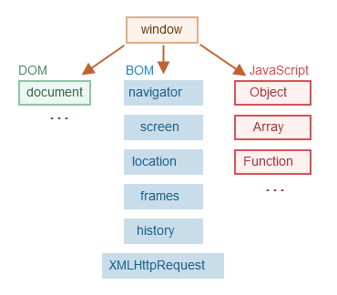

# INTRODUCTION

- JavaScript scripts (programs that are provided and executed as plain text 
  without compilation) can be from inside HTML documents (automatically as 
  the page loads) or on any device that has a JavaScript engine (the 
  browser's engine is called JavaScript Virtual Machine, codenamed 
  differently such as V8 for Chrome, SpiderMonkey for Firefox, etc.)
- Engines (embedded in the browser) reads ("parses") the script, converts 
  ("compiles") the script to machine code, and runs it compiled code
- JavaScript's capabilities greatly depend on the environment it's running 
  in. In the browser, its capabilities are limited to protect the user's 
  safety by preventing an evil webpage from accessing private information or 
  harming the user's data:
  - Access to "local storage" is allowed, but no direct access to OS function or read/write file capabilities
  - Different tabs or windows generally do not know about each other (except 
    when one window uses JavaScript to open another one, but in accordance 
    with "Same Origin Policy" JavaScript from one page cannot access the 
    other page if they come from different domains, ports or protocols)
- There are lots of new languages which are transpiled (converted) to 
  JavaScript before they run in the browser (such as TypeScript)

# JAVASCRIPT FUNDAMENTALS

## HELLO WORLD

- Insertion into HTML using `<script>` tag
```html
<!DOCTYPE html>
<head>
    <title>Demo</title>
</head>
<body>
    <script>
            alert("Hello World");
    </script>
</body>
```
- Using `<script>` tags with `src` attributes to specify the path to the JS file
```html
<script src="/js/script1.js"></script>
<script src="/js/script2.js"></script>
```
  - The browser will download the script and store it in its cache. If other 
    pages use the same script they will take it from the cache instead of 
    downloading it again, thus reducing traffic and making pages load faster
  - If `src` attribute is set, any JavaScript inside the `<script>` tag will 
    be ignored

## CODE STRUCTURE

- JavaScript interprets line break as an implicit semicolon - This is called 
  automatic semicolon insertion
- Put semicolons between statements even if they are separated by newlines
- Single line comments - `//`
- Multiline comments - `/*...*/` (Nested multiline comments are not supported)

## THE MODERN MODE USE STRICT

- Enable modern modifications introduced as part of ECMAScript standards by
using `"use strict"` at top of any JavaScript file
- If you use it at top of any JavaScript function, it will be enabled just for
that function
- Once we start using classes and modules, this won't be further necessary
- If you place it at a line x, it will not be enabled for code present within
lines 0 to x-1
- Used to opt-in a restricted variant of JavaScript which has different
semantics than regular code. For eg. better code optimisation by JavaScript
engines in the browser
- Browsers not supporting strict mode will run strict mode code different from
browsers that do
- Non-strict mode is also referred to as "sloppy mode"
- It can be applied on entire scripts or individual functions, but not to block
statements
  - For entire script - "use strict;" before any other statements
  - For functions - "use strict;" before any statements in the function body

## VARIABLES

- Use `let` instead of `var` to create variables
- Multiple variables are to be declared in multiple statements in different 
  lines
```javascript
let first_name = "Rahul";
let last_name = "Singh";
let age = 25;
```
- Variable names can contain only letters, digits, `$` and `_`, and the 
  first character cannot be a digit, they cannot be reserved words (like 
  `let`, `const`, `class`, etc.) and be meaningful of their job
  - Multiword variables use camelCase
- Use `const` for declaring constants
  - UPPERCASE with underscores names are to be used as aliases for hard 
    coded values
  - Runtime evaluated constants will have normal variable names

## DATA TYPES

- The type of a value can be of 8 types in JavaScript
- JavaScript is "dynamically typed" - so there exists data types but they 
  are bound to the value and not the variable referencing that value
  - Number - Integer or floating-type, can be operated upon by arithmetic 
    operators, special numeric values are `Infinity`, `-Infinity` 
    (representing a number greater than any number) and `NaN`
  - BigInt - Used to represent integers of arbitrary length
  - String - Anything surrounded by quotes (`` - extended functionality quotes,
    '', "" - normal quotes)
  - Boolean - Has only 2 values (`true` and `false`)
  - Null - Reference to a non-existing object (similar to null pointer) 
    meaning nothing, empty or unknown value
  - Undefined - Meaning value is not assigned. Its possible to assign 
    undefined to a variable (but not recommended) - use null instead
  - Objects and Symbols - Objects are used to store collections of data; The 
    Symbol type is used to create unique identifiers for objects
- `typeof` operator returns the type of the operator

```javascript
// dynamic typing
let message = "hello";
message = 12345;

let n = 123;
n = 12.4325;
alert(1/0);     // Infinity
alert(Infinity);    // Infinity
alert("hello" / 2); // NaN
alert(NaN + 1);     // NaN - sticky
alert(NaN ** 0);    // 1 (exception)

const binInt = 123456n; // BigInt

let nameFieldChecked = true;    // Boolean
alert(nameFieldChecked);

let age;        // undefined
let age = null; // age has empty value
age = undefined;// possible but not recommended

typeof null;    // object - recognised as error of typeof
typeof alert;   // function - even though functions belong to the object type
typeof Math;    // object - Math is a built-in object
```

## INTERACTION - ALERT, PROMPT AND CONFIRM

- Functions to interact with user:
  - `alert` - Shows a message inside a modal window and waits for the user to 
    press Ok (meaning the visitor can't interact with the rest of the page 
    until they have dealt with the window)
  - `prompt` - It shows a modal window with a text message (`title`), an input 
    field for the visitor, and the buttons OK/Cancel -> The visitor can type 
    something in the prompt input field to get the text as result, or press 
    Cancel to get `null` as the result
  - `confirm` - Shows a modal window with a question and Ok and Cancel 
    options -> The result is true if press Ok or false if press Cancel

```javascript
alert("Hello");

// result = prompt(title, [default]);
let age = prompt("How old are you?", "Enter age as a number");
alert(`You are ${age} years old!`);

let isBoss = confirm("Are you the boss?");
alert(isBoss);
```

## TYPE CONVERSIONS

- `alert` converts any type to string in order to display it
- Mathematical operators convert values to numbers
- Explicit conversion is required when we read a value from a string-based 
  source like a text form but expect a number to be entered. If string is 
  not a valid number, the result of such a conversion is `NaN`
  - `undefined` -> `NaN`
  - `null` -> 0
  - `true`, `false` -> 1, 0
  - `string` -> Whitespace from the start and end are removed. If string is 
    left then the Number or `Nan`; if string is not left then 0
- Boolean conversion happen in logical operations `Boolean(value)`
  - Empty values (0, `null`, `undefined`, `NaN`, `false`) become false, else 
    true
```javascript
// String conversion
let value = true;
value = String(value);  // "true"

// Numeric Conversions
alert("6" / "2");   // 3, strings are converted to numbers
let num = Number("123");    // explicit conversion to Number type 
```

## BASIC OPERATORS, MATHS

```javascript
let s = "my" + " string";   // concatenation
```

## FUNCTION EXPRESSIONS

- In JavaScript a function is a special kind of value
- Function expressions allow us to create a function that in the middle of 
  an expression
- Omitting the name of function expression is valid
- Its mostly used when we need to create a function and immediately call it, 
  or schedule for a later execution, not stored anywhere, thus remaining 
  anonymous
```javascript
let sayHi = function() {
    alert("hello");
};
// sayHi variable gets a value (the new function)
// name of the function has been omitted - rather the function expression is 
// assigned to a variable directly after its creation
```

- Since a function is a value in JavaScript (whose value is its body)
```javascript
function sayHi() {
    alert("hello");
}
alert(sayHi);   // shows the function's code rather than running it
                // to run a function call it using parentheses

let func = sayHi;   // copying "values"
func();         // output -> hello
```

- Function expressions have semicolon at the end because they are part of an 
  assignment statement `let func = function() {};`, and its recommended to 
  put semicolons at the end of statements, but not function syntax

### CALLBACK FUNCTION

```javascript
function ask(question, yes, no) {
    if (confirm(question)) yes()
    else no();
}

function showOk() {
    alert("You agreed");
}
function showCancel() {
    alert("You cancelled the execution");
}

// usage: functions showOk, showCancel are passed as arguments to ask
ask("Do you agree?", showOk, showCancel);

// Using function expressions this code becomes smaller
ask(
    "Do you agree?",
    function() { alert("You agreed."); },
    function() { alert("You cancelled the transaction"); }
);
```

- The arguments `showOk` and `showCancel` are referred to as Callback 
  functions or just Callbacks. The idea is that we pass a function, and we 
  expect it to be "called back" later if necessary

## ARROW FUNCTIONS

- Better than Function Expressions
- Without curly braces - `(...args) => expression` -> The function
  evaluates the right side expression and returns the result. Parentheses
  can be omitted if there's only a single argument `n => n * 2`
```javascript
// let func = (arg1, arg2, ..., argn) => expression
// Equivalent function expression
/*
let func = function(arg1, arg2, ..., argn) {
    return expression;
}
*/

let sum1 = (a, b) => a + b;
let sum2 = function (a, b) {
  return a + b;
};

let double = n => n * 2;
// Equivalent function expression
let double2 = function (n) {
  return n * 2;
};

let sayHi = () => alert("Hello!");
sayHi();
```

- Arrow functions can be used in the same way as Function Expressions -> to
  dynamically create a function
```javascript
let age = prompt("What is your age?", 18);

let welcome = age < 18 ? () => alert("Hello!") : () => alert("Greetings!");

welcome();
```

### MULTILINE ARROW FUNCTIONS

- With curly braces - `(...args) => { body }` -> Brackets allow us to write
  multiple statements inside the function but we need an explicit
  `return` to return something
```javascript
let sum = (a, b) => {
  // the curly braces opens a multiline function
  let result = a + b;
  return result; // if we need curly brances, then we need an
  // explicit "return"
};
```

### SUMMARY

- Arrow functions are handy for simple one-liner actions. They are of two types:

# CODE QUALITY
# OBJECTS: THE BASICS

##  OBJECTS

- Objects are used to store keyed collections of various data and more 
  complex entities
- An object can be created with figure brackets `{...}` with an optional 
  list of properties
- A property is a "key: value" pair, where `key` is a string (property name) 
  and `value` can be anything
```javascript
let user = new Object();    // "object contructor" syntax
let user2 = {};             // "object literal" syntax - recommended

let user3 = {
    name: "John",   // by key "name" store value "John"
    age: 30         // by key "age" store value 30
};

// get property values of the object using dot notation
alert(user.name, user.age);     // John, 30

// add property value to the object
user.isAdmin = true;

// remove property from the object using delete operator
delete user.age;
```

### PROPERTY NAME LIMITATIONS

- 

### PROPERTY EXISTENCE TEST USING IN OPERATOR

- `in` operator is present to handle an explicit case where a property's 
  value is `undefined` (this is discouraged and `null` should be used for 
  unknown and empty values)
```javascript
let obj = {
    "name": undefined,
    "age": 42,
};

alert(obj.age);     // 42
alert(obj.blabla);  // undefined - not present in object
alert(obj.name);    // undefined - so what does this mean - value is present 
// or not
alert("name" in obj);   // false - means not present
```

### THE FOR-IN LOOP

- Used to loop over all the keys of an object
```javascript
let user = {
    name: "John",
    age: 30,
    isAdmin: true,
};

for (let key in user) { // looping variable name prop is widely used
    // keys
    alert(key);         // name, age, isAdmin
    // values for the keys
    alert(user[key]);   // John, 30, true
}
```

- Objects are ordered in a special way - Integer properties are sorted, 
  others appear in creation order
- Integer properties are strings that can be converted to-and-from an 
  integer without a change. So `"49"` is an integer property, but `"+49"` and 
  `"1.3"` are not
```javascript
let codes = {
    "49": "Germany",
    "41": "Switzerland",
    "44": "Great Britain",
    "1": "USA"
};
for (let code in codes) {
    alert(code);    // 1, 42, 43, 44
}

let codes = {
    "+49": "Germany",
    "+41": "Switzerland",
    "+44": "Great Britain",
    "+1": "USA"
};
for (let code in codes) {
    alert(+code);   // 49, 41, 44, 1    
}
```


# DATA TYPES

## METHODS OF PRIMITIVES

- JavaScript allows us to work with primitives as if they were objects. It also provides methods to call on primitive type objects

- A primitive ia a value of primitive type (`string`, `number`, `bigint`, `boolean`, `symbol`, `null`, `undefined`)

- An object is capable of storing multiple values as properties. They can be created using `{}` (for e.g. `{name: "John", age: 30}`). Functions are also a type of object

- Objects allows us to store a function as one of its properties. There are many in-built object such as those that work with dates, errors, HTML elements, etc., but object require more resource intensive than primitives:
```javascript
// creating a john object with a sayHi method
let john = {
  name: "John",
  sayHi: function() {
    alert("Hi, buddy!");
  }
};

john.sayHi(); // Hi, buddy!
```

## DESTRUCTING ASSIGNMENT

- When we pass `Object` and `Array` to a function, we may not need all of it. Destructuring assignment allows us to unpack arrays and objects into a bunch of variables
```javascript
let arr = ["John", "Smith"];

// arr is not modified
let [firstName, surName] = arr; // same as let firstName = arr[0], surName = arr[1]
alert(firstName);
alert(surName);

// Caesar is ignored
let [firstName, , title] = ["Julius", "Caesar", "Consul", "of the Roman Republic"];
alert(title); // Consul

// Works on any iterable - Its is basically syntax sugar for calling for...of on the operand right hand side of = operator
let [a, b, c] = "abc"; // ["a", "b", "c"]
let [one, two, three] = new Set([1, 2, 3]);

// Assign to any assignables
let user = {};
[user.name, user.surname] = "John Smith".split(' ');
alert(user.name); // John
alert(user.surname);  // Smith

let user = {
  name: "John",
  age: 30,
};
// looping over key-value pairs
for (let [key, value] of Object.entries(user)) {
  alert(`${key}: ${value}`); // name: John\nage: 30
}
```

- Swapping variables using destructuring
```javascript
let guest = "Jane";
let admin = "Pete";

// create a temporary array of two variables, and immediately destructure it in swapped order
[guest, admin] = [admin, guest];
```

- Rest pattern and Default values
```javascript
let [name1, name2, ...rest] = ["Julius", "Caesar", "Consul", "Of the Roman Republic"];
// rest is an array of remaining element
alert(rest[0], rest[1]);  // Consul, Of the Roman Republic

// we get errors only if the right side is bigger than left side (without using rest)
// we get undefined as values for elements that are not present for destructuring
let [name = prompt("name?"), surname = "Anonymous"] = ["Julius"];
alert(name);  // Julius
alert(surname); // whatever prompt gets - default value
```

- Object Destructuring - We should have an existing object on the right side of `=` that we want to split into variables. The left-side contains a object-like pattern for corresponding properties. Order does not matter
```javascript
let options = {
  title: "Menu",
  width: 100,
  height: 200
};

let {width, height, title} = options;
// extracting only what we need
let { title } = options;

// default values using different variable names
options = {
  title: "Menu",
};

let {width: w = 100, height: h = prompt("height?"), title} = options;
alert(`${title}, ${w}, ${h}`);
```

- Rest pattern - If objects have more properties than we have variables
```javascript
let options = {
  title: "Menu",
  height: 200,
  width: 100,
};

// title = property named title
// rest = object with the rest of properties
let {title, ...rest} = options;

// now title="Menu", rest={height: 200, width: 100}
alert(rest.height); // 200
alert(rest.width);  // 100

// to use already existing variables
let title, width, height;
// if parentheses are not used, then {...} will be treated as a code block, and not destructuring, thus giving an error
({title, width, height} = {title: "menu", width: 200, height: 100});
```

- Nested Destructuring - Left side must have the same structure as the right side
```javascript
let options = {
  size: {
    width: 100,
    height: 200,
  },
  items: ["Cake", "Donut"],
  extra: true,
};

let {
  size: { // put size here
    width,
    height,
  },
  items: [item1, item2],  // assign items here
  title = "Menu", // not present in the object (default value is used)
} = options;
```

- Use cases:
- Smart function parameters - When dealing with function that have large number of parameters, it leads to cumbersome code when calling those functions, and remembering the order of parameters is difficult as well. We can use object destructuring to resolve this issue by simply passing just the object, and the parameters are assigned automatically
```javascript
// sample function
function showMenu(title = "Untitled", width = 200, height = 100, items = []) {...}
// calling the function - long function calls, and order of parameters is difficult to determine
showMenu("My Menu", undefined, undefined, ["Item 1", "Item 2"]);

// use object destructuring instead
let options = {
  title: "My Menu",
  items: ["Item 1", "Item 2"]
};

// using {} as default value so that there is always something to destructurise
function showMenu({title = "Untitled", width = 200, height = 100, items = []} = {}) {
  // title, items -> taken from options
  // width, height -> defaults used
  alert(`${title} ${width} ${height}`); // My Menu 200 100
  alert(items); // Item 1, Item 2
}

// To rename property names and use different variables instead
function showMenu({titlev = "Untitled", width: w = 100, height: h = 200, items: [item1, item2]} = {}) {
  alert(`${title} ${w} ${h}`);
  alert(item1);
  alert(item2);
}

// simpler function call without need to remember order of parameters
showMenu(options);
```

# ADVANCED WORKING WITH FUNCTIONS

# OBJECT PROPERTIES CONFIGURATION

# PROTOTYPES, INHERITANCE

# CLASSES

# ERROR HANDLING - TODO: CUSTOM ERRORS WHOLE CHAPTER (SINCE IT CONTAINS CLASSES)

## ERROR HANDLING USING TRY...CATCH

- `try...catch` allows us to "catch" runtime errors so the script can, 
  instead of dying, do something more reasonable (so it must be a 
  syntactically correct JavaScript program - it should not have any 
  "parse-time" errors which occur when JavaScript engine first reads the code)
```javascript
try {
    // code
    // if no error found then try block is executed and catch block is skipped
} catch (err) {
    // error handling
    // if error found then err will contain the error object
}
```

- `try...catch` works synchronously and it won't catch errors in asychronous 
  code (because the function itself is executed later after the engine has 
  already left the try-catch construct)
```javascript
// to handle async code the try-catfch must be inside the function
/*
try {
    setTimeout(function() {
        noSuchVariable;
    }, 1000);
} catch (err) {
    alert ("wont work");
}
*/
setTimeout(function() {
    try {
        noSuchVariable; // try...catch handles this error 
    } catch {   // if you don't need error details catch can omit it
        alert(" error is caught here!"); 
    }
}, 1000);
```

### ERROR OBJECT

- When an error occurs, JavaScript generates an object containing the 
  details about it, which is then passed as an argument to `catch`
- Error object has two main properties - `name` and `message`, `stack`

### THROWING OUR OWN ERRORS

- Use the `throw` operator
```javascript
throw <error_object>
// error_object can even be primitives, but prefer using an object with a 
// name and message property for compatibility reasons
// JavaScript provides in-built error_objects like Error(message), 
// SyntaxError(message), ReferenceError(message), TypeError(message)
let error = new Error("Things Happen :(");
```

### RETHROWING

- Catch should only process errors it knows, and rethrow all others
- Rethrowing technique:
  - catch gets all errors
  - In the `catch(err) {}` block we analyze the error object `err`
  - If we don't know how to handle it we do `throw err`
```javascript
function readData() {
    let json = `{ "age": 30 }`; // incomplete data

    try {
        let user = JSON.parse(json);
        if (!user.name) {
            throw new SyntaxError("Incomplete data: No name");
        }
        blabla();   // unexpected error which isn't present in our catch block
        alert(user.name);
    } catch (err) {
        if (err instanceof SyntaxError) {   // if we get incorrect data then handle
            alert("JSON Error: " + err.message);
        } else {    // for any other issues we might encounter rethrow the error
            throw err;  // rethrow (*) 
        }
    }
}

try {
    readData();
} catch(err) {
    alert("External catch got: " + err); // caught any other errors
}
```

### TRY...CATCH...FINALLY

- `finally` is used to execute always (even if there] is a `return` statement 
  present inside of `try` and it gets executed just before the `return`) 

### GLOBAL CATCH

- JavaScript environments provide functions for logging uncaught errors. For 
  e.g. NodeJS provides `process.on("uncaughtException)` and in the browser 
  we can assign a function to the `window.onerror` property which will run 
  in case of an uncaught error
```javascript
window.onerror = function(message, url, line, col, error) {}
// message - Error message
// url - path of the script where error happened
// line, col - where error happened
// error - Error Object
```
- Web services provide error-logging functionality as well which provide a 
  JS script to insert on pages (which sets a custom `window.onerror` 
  function), and if an error occurs, the script sends a network request to 
  the service about it. We can log into the service and see the error (for e.
  g. https://errorception.com or https://www.muscula.com)

## CUSTOM ERRORS, EXTENDING ERRORS

- 

# PROMISES, ASYNC/AWAIT

## INTRODUCING CALLBACKS

- JavaScript host environments allow you to schedule asynchronous actions 
  (tasks that initiate now but finish later). For e.g. `setTimeout`

## PROMISE

## PROMISES CHAINING

## ERROR HANDLING WITH PROMISES

## PROMISE API

## PROMISIFICATION

## MICROTASKS

## ASYNC / AWAIT

- What is synchronous JavaScript?
  - Synchronous code is executed line by line in the order it which it is defined in the code
  - One statement is executed only after the previous one has finished
  - This has a problem - If one of the statements takes a long time to finish, it will prevent the execution of rest of
  the code
  - For eg.
```javascript
const p = document.querySelector('.p');
p.textContent = "My name is Rahul";
alert("Text set!");    // takes long to execute (until user clicks on OK)
p.style.color = 'red';  // execution halts till alert() prompt is dealt with
```

- What is asynchronous JavaScript?
  - Asynchronous code is executed after a task that runs in the background finishes
  - It is non-blocking, so it doesn't stop the execution of rest of the code
  - For eg.
```javascript
const p = document.querySelector(".p");
setTimeout(function() {      // setTimeout uses the callback function asynchronously - after 5s has crossed
  p.textContent = "My name is Rahul";
}, 5000);
p.style.color = "red";

const img = document.querySelector(".dog");
img.src = "dog.jpg";    // asynchronously loaded (to keep file loading times in check for large pictures)
img.addEventListener("load", function() {
  img.classList.add("fadeIn");
});
p.style.width = "300px";
```
- NOTE - Callback functions alone do not make the code asynchronous

- What is asychronous JavaScript used for?
  - To make AJAX calls to APIs

- What is AJAX?
  - AJAX stands for Asynchronous JavaScript and XML
  - It allows us to communicate with web servers in an asynchronous way
  - Using AJAX calls we can request data from web servers dynamically (use data from web servers without page reload)
  - XML is not used anymore; all data transmission between the server and the client (browser) happends in JSON format
  

- 


# GENERATORS, ADVANCED ITERATION

# MODULES

- A JavaScript file is a module containing a class or a library of functions 
  for a specific purpose. They are combined to form an application
- `export` - labels variables and functions that should be accessible from 
  outside the current module
- `import` - allows the import of functionality from other modules
```javascript
// sayHi.js
export function sayHi(user) {
    alert(`Hello, ${user}`);
}

// main.js
import {sayHi} from "./sayHi.js";

alert(sayHi);   // function
sayHi("John");
```

# DOCUMENT

## BROWSER ENVIRONMENT, SPECS

- Host environment - A platform that is capable of executing JavaScript (browser
or webserver, or another host machine). Each host environment provides its own
objects and functions in addition to the language core
- 
- `window` - root object
  - It is a global object for JavaScript code (`window.alert("Hello World");`)
  - Represents the browser window and provides methods to control it
  (`window.innerHeight`)

## DOM(Document Object Model)

- Represents all page contents as objects that can be modified
- `document` object is the main entry point to the page. We can change or create
anything using it

# INTRODUCTION TO EVENTS

## 

# DOCUMENT AND RESOURCE LOADING

## DOMContentLoaded, load, beforeunload, unload

- Lifecycle of HTML page:
  - `DOMContentLoaded` - The browser fully loaded HTML and the DOM tree is built
  but external resources like pictures, `img` and stylesheets are not
  - `load` - not only HTML is loaded, but also all the external resources
  - `beforeunload / unload` - The user is leaving the page


# STORING DATA IN THE BROWSER

## Cookies, document.cookie

- Cookies are part of HTTP
- Small strings of data that are stored directly in the browser
- Sent by a web server using the response `Set-Cookie` HTTP header. Then the
browser automatically adds them to every request to the same domain using the
`Cookie` HTTP header
- Used for authentication - Upon sign-in, the server uses the `Set-Cookie` HTTP
header in the response to set a cookie with a unique "session identifier". Next
time the request is sent to the same domain, the browser sends the cookie over
the next using the `Cookie` HTTP header so the server knows who made the request
- Access cookies from the browser using `document.cookie` property

### Reading from document.cookie

- To get the cookies stored from a particular website - `document.cookie`
  - It consists of `name=value` pairs delimited by `;`
  - To find a particular cookie, split `document.cookie` by `;` and find the
  right name

### Writing to document.cookie

- `document.cookie` is not a data property, it an accessor (getter/setter)
- A write operation to `document.cookie` updates only the cookie mentioned in it
and doesn't touch other cookies
- `name` and `value` of a cookie can have any value, but to keep formatting
valid they should be escaped using a built-in `encodeURIComponent` function
```javascript
// special characters (space) needs encoding
let name = "my name";
let value = "Rahul Singh";

// encodes the cookie
document.cookie = encodeURIComponent(name) + "=" + encodeURIComponent(value);
console.log(document.cookie);  // my%20name=Rahul%20Singh
```

#### Limitations
- We can only set/update a single cookie at a time using `document.cookie`
- Each `name=value` pair should not exceed 4KB (so nothing huge can be stored in
a cookie)
- Total number of cookies is around 20 per domain

### domain

- `domain = site.com`
- Specifies where the cookie is accessible
- There's no way to let a cookie be accessible from another 2nd-level domai. So
`other.com` will never receive a cookie set at `site.com`. This is a safety
restriction to allow us to store sensitive data in cookies that should be
available only on one site
- By default, a cookie is not shared with a subdomain (so cookie for `site.com`
will not be shared with `forum.site.com`). But this can be changed
  - When setting a cookie at `site.com` we should explicitly set the `domain`
  attribute to the root domain (`domain=site.com`)
```javascript
document.cookie = "user=Rahul; domain=site.com";
console.log(document.cookie);  // at forum.site.com subdomain user=Rahul
```

### secure

- `secure`
- To enforce cookie should be transferred only over HTTPS
- By default, if we set a cookie at `http://site.com` then it also appears at
`https://site.com` and vice-versa, as cookies are domain-based and do not
distinguish between protocols
- 

### samesite

- Used to protect from XSRF (cross-site request forgery) attacks

#### XSRF attack

- 

### httpOnly

- Forbids any JavaScript access to the cookie. So `document.cookie` is invisible
- This is done to protect from attacks when a hacker injects his own JavaScript
code into a page (which should not be possible, but it can happen due to bugs)
and waits for a user to visit that page. When a user does visit the webpage, 
the code executes and gains access to `document.cookie` with user
cookies containing authentication information

### Cookie Functions

- `getCookie(name)`, `setCookie(name, value, attributes)`, `deleteCookie(name)`
- Updating and deleting a cookie should use the same path and domain attributes
as when we set it
```javascript
function getCookie(name) {
  let matches = document.cookie.match(new RegExp(
    "(?:^|; )" + name.replace(/([.$?*|{}()[\]\\/+^])/g, '\\$1') + "=([^;]*)"
  ));
  return matches ? decodeURIComponent(matches[1]) : undefined;
}

function setCookie(name, value, options = {}) {

  options = {
    path: '/',
    // add other defaults here if necessary
    ...options
  };

  if (options.expires instanceof Date) {
    options.expires = options.expires.toUTCString();
  }

  let updatedCookie = encodeURIComponent(name) + "=" + encodeURIComponent(value);

  for (let optionKey in options) {
    updatedCookie += "; " + optionKey;
    let optionValue = options[optionKey];
    if (optionValue !== true) {
      updatedCookie += "=" + optionValue;
    }
  }

  document.cookie = updatedCookie;
}

// To delete a cookie set a negative expiration date
function deleteCookie(name) {
  setCookie(name, "", {
    'max-age': -1
  })
}
```

### Third-Party Cookies

- A cookie placed by a domain other than the page the user is visiting
- Generally used for tracking and ads services. The originating domain can track
the same user between different sites, if they all access it
  - A page at `site.com` loads a banner from another site `ads.com`
  - The remote server at `ads.com` sets the `Set-Cookie` header with a cookie
  like `id=1234`. Such a cookie originates from `ads.com` and is only visible to
  it
  - Next tiem `ads.com` is accessed, the remote server gets the `id` cookie and
  recognises the user
  - When the user moves from `site.com` to `other.com` which also has a banner,
  then `ads.com` gets the cookie as it belongs to `ads.com` thus recognising
  the visitor and tracking him as he moves between sites
- If a script (from a third-party domain) sets a cookie (using `document.cookie`
) then no matter where the script came from, the cookie belongs to the domain of
the current webpage

### GDPR

- There's a legislation in Europe that enforces a set of rules for websites to
respect the users' privacy. One of these rules require explicit permission for
tracking/identifying/authorizing cookies
- Websites generally have 2 variants of complying with GDPR:
  - To set tracking cookies only for authenticated users - Registration form
  should have a checkbox like "Accept the Privacy Policy" that describes how the 
  cookies are used, and the user must check it
  - To set tracking cookies for everyone - Show a modal "Splash Screen" and
  require everyone to agree to the cookies. Only then the website can let the
  people see the content

## LocalStorage, sessionStorage

- Allows us to save key-value pairs in the browser
- Data survives a page refresh (for `sessionStorage`) and even a full browser
restart (for `localStorage`)
- Web storage objects are not sent to server with each request. So we can store
much more (at least 5MB)
- The server can't manipulate storage objects via HTTP Headers
- The storage is bound to the origin (domain/protocol/port). Different protocols
or subdomains infer different storage objects - they can't access data from each
other
- Methods and properties - `setItem(key, value)`, `getItem(key)`,
`removeItem(key)`, `clear()` (delete everything), `key(index)` (get the key on a
given position), `length` (number of stored items)

### localStorage Demo

- Main features:
  - Shared between all tabs and windwos from the same origin
  - The data does not expire (remains even after browser restart and OS reboot)
- 

## IndexedDB

- Database built into the browser
- More performant than `localStorage`
  - Stores almost any kind of values by keys
  - Supports transactinos for reliability
  - Supports key range queries, indexes
  - Can store much bigger volumes of data than `localStorage`
- Used for offline apps (overkill for client-server applications)
- Data is stored in visitor's home directory

# WEB COMPONENTS

- Splitting UI into various reusable units which handle their own complexity
- Usually provided by frameworks, but can be provided by the browser itself:

## CUSTOM ELEMENTS

- Create custom HTML elements described by class with its own methods, events,
properties and so on
- Once defined, we can use it just like built-in HTML elements
- Types of custom elements:
  - Autonomous custom elements - "All-new" elements, extending the `HTMLElement`
  class
  - Customised build-in elements - Extending built-in elements

## SHADOW DOM

## CSS SCOPING

## EVENT RETARGETING


