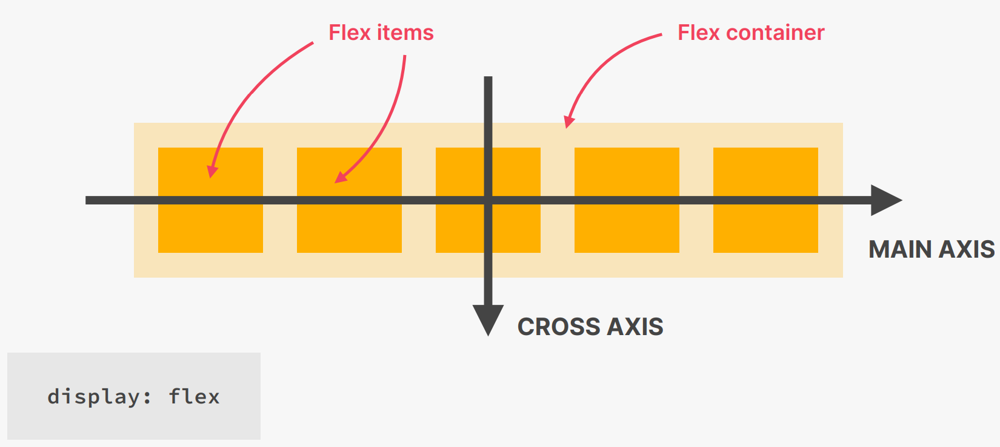
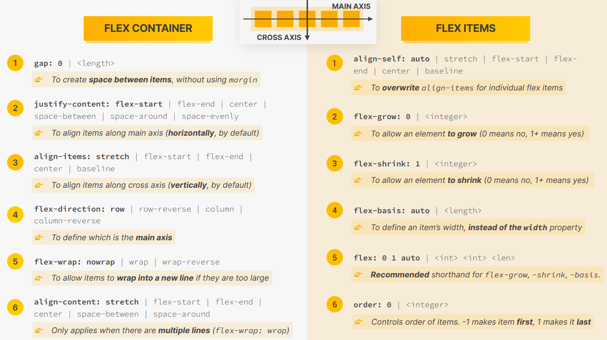

## TYPES OF LAYOUTS

- Page Layout - Layout down elements (big pieces of content) inside of a webpage. They are themselves made out of components, who have their own layouts.
- Component Layout - The layout of each component which makes up the webpage. We cannot lay down elements one after the other in a component as it would lead to bad UX

## LAYOUT FORMATS

- Flexbox - When you want elements' intrinsic widths to have a say in the final
layout (for eg. in a navigation menu, we would like each button to be a certain
width depending on the length of the menu item, and not all items should be as
long as the longest menu)
- CSS Grids - When you want a rigid pattern (equal width columns or rows) with
each element having basically no say in what should be their widths. They need 
to fit into the cells provided to them
- Floats (only legacy purposes)
- Hidden - `display: none`

## FLEXBOX

- The `.container` class becomes the flex container, and all its immediate
children becomes flex items. By default each flex item will take as much space
as it need for its content
- Vertically though each item will be as tall as the tallest flex item.  
```css
.container {
    display: flex;
    /* To align items along the cross axis */
    align-items: flex-start/flex-end/center/stretch (default);

    /* To align items along the main axis */
    justify-content: flex-start/flex-end/center/space-between/space-around;
}
```

- Flexbox solves common problems such as vertical centering and creating equal
height columns. Empty space inside a container element can be automatically
divided by its child elements
- 
- 

- `gap` property was introduced to insert gaps between flex-items, without
having to remove gap from the items at the extreme ends

- We don't specify the `width` of each flex item using the `width` property. Use
the `flex-basis: <value>` property. It is sort of a recommendation to grant the
elements the specified width, but there can be a situation where if the items
are at that specified width, they will overflow the flex container

- By default, flex items will occupy width = max(`width`, `max-content`)
    - If SUM(width of each flex item) <= width(flex container) then its fine
    - If SUM(width of each flex item) > width(flex container) then `flex-shrink`
    comes to the rescue
        - if `flex-shrink: 0` then items would overflow the flex container
        - if `flex-shrink: 1` (default) then flex items would shrink equally
        until their `width` = `min-content`, after which they will overflow the
        flex container on further shrinking

- By default `flex-grow: 0`. So flex items occupy width = max(`width`, 
`max-content`)
    - If SUM (width of each flex item) >= width(flex container) then items get
    squished as per `flex-shrink` property
    - If SUM(width of each flex item) < width(flex container) then `flex-grow`
    comes into picture
        - If `flex-grow: 0` (default) then nothing happens
        - If `flex-grow: 1` then the remaining space will be evenly distributed
        amongst all the flex items. Thus the flex items will have a width of
        max(`width`, `max-content`) + (remaining-size/number of flex-items). 
        This means that there is no guarantee that flex items become of equal
        width (in fact they will become equal width only if they had equal width
        initially before `flex-grow: 1`)
            - If this is applied to an individual flex item, then 

- Flexbox always starts by calculating the content size for each flex item. This
is intrinsically set to `width: max-content` for each flex item (provided the
items don't have a width explicity set for them using `width` or `flex-basis` -
if so then the specified width will be the width of the flex item)
- Then it arranges the items in a row, or in a column depending upon the value
of `flex-direction` property
- Now it will start looking if the elements overflow the flex container along
the main axis, and depending upon the value of `flex-shrink` it will either
shrink the items, or let them overflow the container (by default it shrinks)
- If the items don't overflow the container, and rather there is empty space
present after placing the elements, then the `flex-grow` property comes into
picture. If its is set to 1, then the remaining space will be divided and added
to the flex items
- Both the shrinking and the growing takes place proportionally to the width of
the flex items. So if the width of an item is large initially, the change in its
width due to a shrink or growth will be larger, as compared to that of a smaller
width flex item


- However, if there is no width specified to the flex items, the `flex-grow`
property comes into the picture. It is 1 by default, which allows the flex items
to be of equal width and thus grow to the max possible width without overflowing
the flex container. If it is 0 then they will occupy just the width of their
content. If you apply this only on a single element, then the rest of the
elements will first be placed, each given just enough width to accomodate their
content, and the remaining space will be granted to the `flex-grow: 1` item. But
putting `flex-grow: 2/3/4...` (any number greater than 1) 

- To set columns of equal size we can use two approaches on all the flex items:
    - We can set the `flex-basis` of each flex item to be 100% of the width of
    the flex container, and set `flex-shrink: 1`. So now every element would
    want to be as wide as the flex container, but when flexbox will see that the
    flex items are overflowing the container, then it will start shrinking the
    flex items. But since all flex items were given same initial widths, so they
    will shrink same amount (keeping change proportional) and thus end up with
    the same widths
    - Another approach will be to set `flex: 1` for all the flex items. This
    sets the content size of each flex item to 0, and since we have `flex-grow`
    as 1, so these elements would grow to take up all the available space (which
    is the entire container's width in this case)
- Both of these approaches will not provide equal width columns if the flex
items themselves don't have equal amounts of padding or border. This is because
flexbox works on content width, and ignores padding and border widths. So
    - In the first approach, the total space that will need to be distributed
    amongst the flex items would be (width of all flex items - total padding -
    total border). After division of this space amongst the flex items, the
    padding and borders would be added to the elements
    - In the second approach, the total space that will need to be distributed
    amongst the flex items would be (width of the flex container - total padding
    - total border). After division of this space amongst the flex items, the
    padding and borders would be added to the elements.
    - For an equal amount of total width, padding and border, the second
    approach gets us closer to the exact ideal amount for each flex item (which
    would basically ignore the subtraction of padding and border, and use a
    similar approach to `border-box` property, as the deducation is being done
    on a much larger space rather than just the flex container's width)
```css
/* First Approach */
.flex-container > * {
    flex-basis: 100%;
    flex-grow: 0;
    flex-shrink: 1;
}

/* Second container */
.flex-container > * {
    flex: 1;
    /*
    flex-grow: 1;
    flex-shrink: 1;
    flex-basis 0;
    */
}
```
- To irradicate this issue use grids since we require a rigid structure where
each column needs to be of equal widths, and the content of an child element
should have no say in the width that it should occupy in the final layout

- Other features (such as `align-items`, `justify-content`) work on the same
principle of calculating available space by subtracting margins and paddings
from the total available space (so similar to the operation of `content-box`).
So if elements are not aligning properly even after adding these properties then
the issue is with flex items not having same amounts of `margin` or `padding`

## CSS GRID

- 