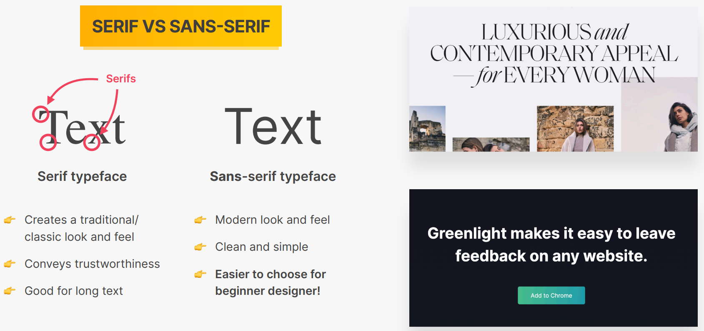

- Web Design is broken down into 9 ingredients (categories)
    - Typography - Formatting and Designing text
    - Colors
    - Images / Illustrations
    - Icons
    - Shadows
    - Border-radius (the rounding of edges)
    - Whitespace
    - User Experience
    - Components / Layouts

- Web sites can have different personalities, and depending upon the personality
we have to use different values for these ingredients
    - Serious/Elegant - For luxury and elegance. Use thin serif typefaces, gold
    or pastel colors, and high big quality images
    - Minimalist/Simple - Focuses on important text content, and uses small or
    medium sized black text, some lines may be presents, and very few images and
    icons
    - Plain/Neutral - Used in big corporations (such as Microsoft or Adobe). In
    this personality, the design gets out of the way by using neutral and small
    typefaces and a very structured layout
    - Bold/Confident - Big and full typography together with bright and big
    coloured blocks
    - Calm/Peacful - For products and services that cater to the customer, and
    take their care into account. Use calming pastel colors, and soft serif
    headings together with images and illustrations that match the typeface or
    the colors
    - Starup/Upbeat - Modern looking sans-serif typefaces, light grey text and
    backgrounds and rounded elements
    - Playful/Fun - Colorful and round designs created using creative elements
    such as hand-drawn icons or illustrations, lots of animations, and language
    of the content itself helps to convey to play for all fun personality

## TYPOGRAPHY

- 
    - Sans Serif typefaces - Inter, Open Sans, Roboto, Montserrat, Work Sans, Lato
    - Serif typefaces - Merriweather, Aleo, Playfair Display, Cormorant, Cardo, Lora
- Limit to maximum of 2 typefaces
- Use a Type Scale tool or pre-defined ranges for font sizes and limit them
    - For normal text - 16px to 32px
        - For long text (like a blog post) - 20px or bigger
    - For headlines go big (50px+) and bold (600+)
    - Don't use a font weight below 400 (regular)
- For a good reading experience:
    - Use less than 75 characters per line
    - For normal sized text use a line height between 1.5 and 2. For big text
    go below 1.5 (the smaller or longer the text, the larger the line height)
    - Decrease letter spacing in headlines, if it looks unnatural
    - Experiment with all caps for short titles. Make them small and bold and
    decrease letter-spacing
    - Don't justify text
    - Don't center long text blocks. Small blocks are fine